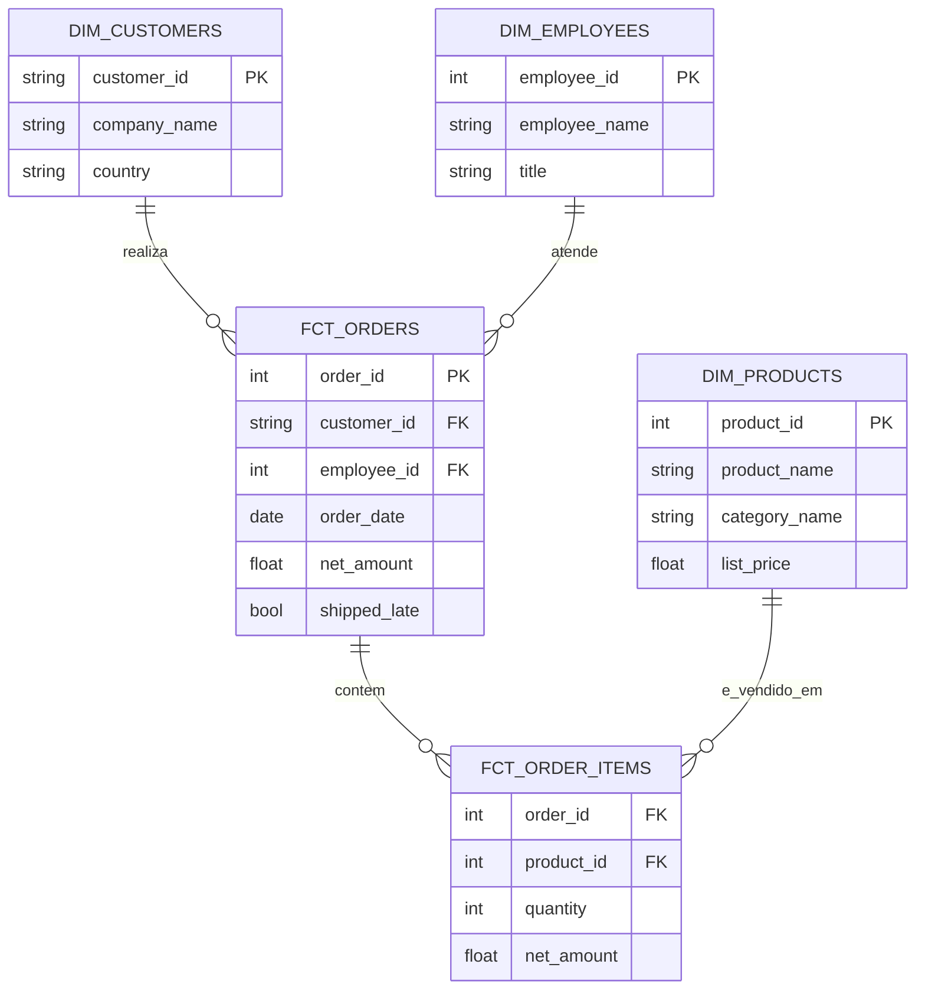

# Northwind no BigQuery — analise dados do SQL Server sem instalar nada

Analise o Northwind, a base de dados de exemplo clássica do SQL Server,
direto no BigQuery: um processo 100% gratuito, 100% pelo navegador — sem
instalar SQL Server, Docker ou qualquer CLI — e 100% reproduzível por
qualquer pessoa, do zero.

## Sobre o projeto

O Northwind simula uma empresa de importação e exportação de alimentos, e
é tradicionalmente usado para ensinar modelagem relacional em SQL Server.
Este projeto recria esse mesmo banco como um data warehouse no BigQuery:
carrega os dados brutos a partir dos arquivos parquet, padroniza-os em uma
camada de staging e organiza um modelo dimensional (star schema) pronto
para análise.

A proposta é dupla: servir como material de prática para quem quer
treinar SQL com o Northwind sem montar um ambiente SQL Server, e mostrar,
de ponta a ponta, o trabalho de um analista de dados — ingestão,
modelagem dimensional e SQL analítico. Os arquivos parquet originais do
Northwind estão versionados aqui, então ninguém precisa de nenhuma fonte
externa nem de instalar nada: só uma conta Google gratuita e um
navegador.

## Por que BigQuery, e não SQL Server?

O Northwind é normalmente distribuído como um backup do SQL Server, o que
significa instalar o SQL Server (ou subir um container) só para abrir um
banco de exemplo — fricção desnecessária para quem quer praticar SQL de
forma rápida. Migrar o Northwind para o BigQuery resolve isso:

- **Zero instalação.** Não precisa de SQL Server, Docker, nem de um
  computador Windows — só uma conta Google e um navegador.
- **Reproduzível por qualquer pessoa.** Quem baixar os arquivos parquet
  deste repositório sobe os dados e roda as consultas direto no console
  do BigQuery, pelo navegador, em minutos, no nível gratuito (Sandbox).
- **Mais perto do que o mercado usa hoje.** Boa parte da análise de dados
  aconteceu de bancos on-premise para data warehouses na nuvem. Modelar o
  Northwind como um star schema no BigQuery pratica exatamente esse tipo
  de trabalho, em vez de um SQL Server isolado num laptop.
- **É o meu stack no dia a dia.** Eu já trabalho com BigQuery
  profissionalmente — faz mais sentido praticar modelagem dimensional e
  SQL analítico na mesma ferramenta que uso de verdade do que aprender de
  novo em um dialeto (T-SQL) que não uso.

## Arquitetura

```
data/raw/*.parquet
        │
        ▼  upload pelo console do BigQuery (ou scripts/load_raw_to_bigquery.sh)
  northwind_raw          (tabelas originais, sem transformacao)
        │
        ▼  sql/staging/*.sql (colar no editor de consultas, ou scripts/run_sql_transformations.sh)
  northwind_staging       (nomes e tipos padronizados)
        │
        ▼  sql/dw/*.sql
  northwind_dw             (modelo dimensional: fatos e dimensoes)
```

## Modelo dimensional



## Dataset de origem

10 tabelas cobrindo clientes, pedidos, itens de pedido, produtos,
categorias, fornecedores, funcionários, territórios e transportadoras. Os
arquivos parquet de cada uma estão em `data/raw/`.

## Estrutura do repositório

```
northwind-bq/
├── data/raw/                        # os 10 arquivos parquet originais do Northwind
├── sql/
│   ├── staging/                     # views que padronizam nomes (snake_case) e tipos
│   └── dw/                          # dimensoes e fatos (numeradas na ordem de execucao)
├── scripts/                         # opcional: automatiza a ingestao/transformacao via gcloud CLI
│   ├── load_raw_to_bigquery.sh
│   └── run_sql_transformations.sh
└── README.md
```

## Camadas

| Camada  | Dataset             | Conteúdo                                                          |
|---------|----------------------|-------------------------------------------------------------------|
| raw     | `northwind_raw`     | Tabelas originais, carregadas do parquet pelo script de ingestão   |
| staging | `northwind_staging` | Views que padronizam nomes (`orderID` → `order_id`) e tipos        |
| dw      | `northwind_dw`      | `dim_customers`, `dim_products`, `dim_employees`, `fct_orders`, `fct_order_items` |

## Como reproduzir — 100% pelo navegador, sem instalar nada

Qualquer pessoa com uma conta Google consegue reproduzir o projeto
inteiro só pelo navegador, no console do BigQuery — sem instalar nada, sem
pedir acesso a nada e sem vincular faturamento em nenhum passo.

### 1. Pré-requisito

Só uma conta Google e um projeto no [console do BigQuery](https://console.cloud.google.com/bigquery)
(o nível gratuito/Sandbox é suficiente — ele é oferecido automaticamente
caso o projeto ainda não tenha faturamento ativo).

### 2. Ingestão: parquet → BigQuery, pelo console

1. Baixe os 10 arquivos de `data/raw/` deste repositório para o seu
   computador.
2. No console do BigQuery, crie um dataset chamado `northwind_raw`
   (botão de três pontos ao lado do nome do projeto → **Criar conjunto de
   dados**).
3. Para cada um dos 10 arquivos: **Criar tabela** → **Upload** → selecione
   o arquivo parquet → formato **Parquet** → nome da tabela igual ao nome
   do arquivo (ex.: `orders.parquet` → tabela `orders`) → **Criar
   tabela**. O parquet já carrega o schema junto, então não precisa
   configurar colunas manualmente.

### 3. Transformação: staging + data warehouse, pelo console

1. Abra o **Editor de consultas** do BigQuery.
2. Cole e execute, um de cada vez, o conteúdo dos 10 arquivos em
   `sql/staging/` deste repositório — isso cria o dataset
   `northwind_staging`.
3. Cole e execute, um de cada vez e **na ordem numerada**, o conteúdo dos
   5 arquivos em `sql/dw/` — isso cria o dataset `northwind_dw`. A ordem
   importa porque `04_fct_order_items` precisa rodar antes de
   `05_fct_orders`, que depende dela.

Pronto: `northwind_dw` já tem as tabelas fato e dimensão prontas pra
análise — sem ter instalado absolutamente nada.

## O que este projeto pratica

- Ingestão de arquivos parquet para um data warehouse na nuvem
- Modelagem dimensional (star schema): fatos e dimensões
- SQL analítico no BigQuery — joins, agregações, métricas derivadas (receita
  líquida, prazo de entrega, pedidos em atraso)
- Organização de um projeto de dados versionado em Git, reproduzível do
  zero, sem instalar nada e sem depender de nenhuma ferramenta paga

## Quer automatizar? (opcional)

O caminho acima — console web, sem instalar nada — é o principal deste
projeto. Para quem já usa [gcloud CLI](https://cloud.google.com/sdk/docs/install)
e prefere automatizar em vez de clicar, os scripts em `scripts/` fazem a
mesma coisa com dois comandos:

```bash
gcloud auth login
gcloud config set project SEU_PROJETO_ID
./scripts/load_raw_to_bigquery.sh SEU_PROJETO_ID   # ingestao
./scripts/run_sql_transformations.sh SEU_PROJETO_ID # staging + dw
```

Essa mesma transformação também pode ser feita com um framework de
transformação, caso queira ir além:

- **dbt Core**: roda por CLI/CI, sem depender de faturamento no Google
  Cloud, e o mesmo conhecimento se aplica a outros bancos além do BigQuery.
- **Dataform**: roda dentro do BigQuery Studio; conectar ao Git
  nativamente exige faturamento ativo no projeto, por causa do Secret
  Manager.

## Observações

- Os arquivos parquet são pequenos (o maior tem ~37 KB), por isso ficam
  versionados direto no Git, sem Git LFS ou bucket no Cloud Storage.
- Se o projeto do BigQuery estiver no modo Sandbox (sem faturamento
  ativo), as tabelas criadas expiram em 60 dias por padrão. Isso não
  impede rodar o projeto — só significa recriar as tabelas depois desse
  prazo, repetindo os passos de upload e consulta (ou rodando os scripts
  de novo, se preferir o caminho automatizado).

## Autora

Laura Carvalho — [github.com/lauracarvalhg](https://github.com/lauracarvalhg)
